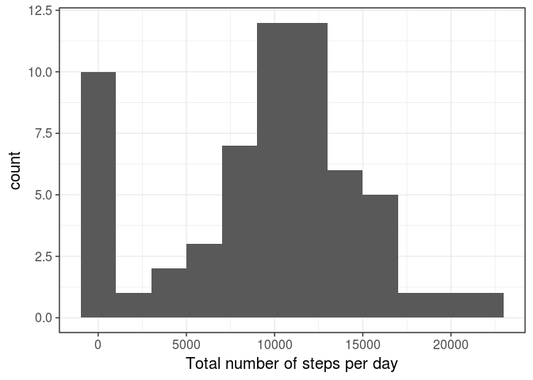
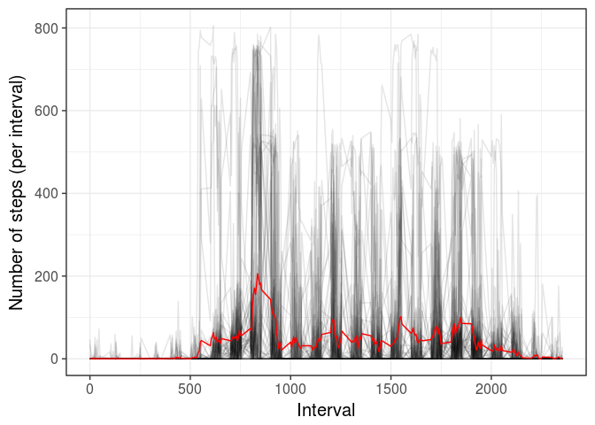
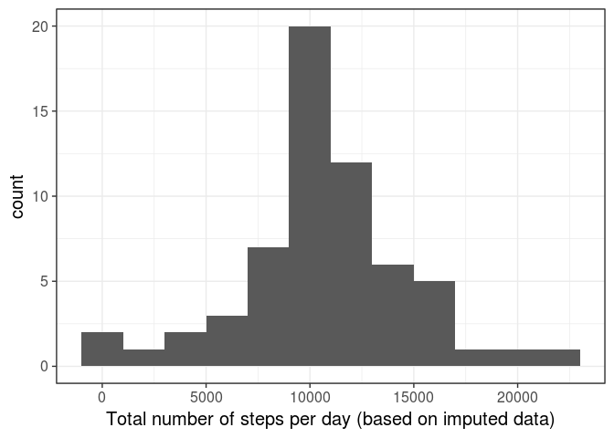
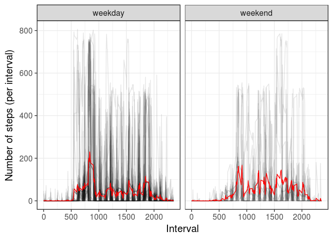

# Reproducible Research: Peer Assessment 1
Stephan Gade  


```r
# load libraries
library(knitr)
library(ggplot2)
library(dplyr)
library(pander)

# setup global knitr options
knitr::opts_chunk$set(error = TRUE, message = FALSE, results = 'hide', warning = FALSE, echo = TRUE, fig.path = "figure/")

# Set local for english weekdays 
Sys.setlocale("LC_TIME","C")
```


## Loading and preprocessing the data

At first we have to read the data. We assume that the file **activity.zip** is in the same folder like the R-markdown file. We can directly read the csv file from the archive:


```r
data_activity <- read.csv(unz(description = "activity.zip", filename = "activity.csv"))
pander(head(data_activity))
```


-----------------------------
 steps     date     interval 
------- ---------- ----------
  NA    2012-10-01     0     

  NA    2012-10-01     5     

  NA    2012-10-01     10    

  NA    2012-10-01     15    

  NA    2012-10-01     20    

  NA    2012-10-01     25    
-----------------------------

As we can see the data contains the number of steps per interval and day. 


## What is mean total number of steps taken per day?

We can calculate the total number of steps, as well as the mean/median number of steps per day:


```r
data_steps <- data_activity %>% 
  group_by(date) %>% 
  summarize(total_steps = sum(steps, na.rm = T),
            mean_steps = mean(steps, na.rm = T),
            median_steps = median(steps, na.rm = T)) %>% 
  ungroup()
```

and create a histogram of the total number of steps across all days


```r
data_steps %>% 
  ggplot(aes(x = total_steps)) +
  geom_histogram(binwidth = 2000) +
  theme_bw(15) +
  xlab("Total number of steps per day")
```

<!-- -->

The mean/median number of steps for each day are:


```r
data_steps %>% 
  select(Day = date, `Number of steps (mean)` = mean_steps, `Number of steps (median)` = median_steps) %>% 
  pander()
```


--------------------------------------------------------------
   Day      Number of steps (mean)   Number of steps (median) 
---------- ------------------------ --------------------------
2012-10-01            NA                        NA            

2012-10-02        0.4375000                     0             

2012-10-03        39.4166667                    0             

2012-10-04        42.0694444                    0             

2012-10-05        46.1597222                    0             

2012-10-06        53.5416667                    0             

2012-10-07        38.2465278                    0             

2012-10-08            NA                        NA            

2012-10-09        44.4826389                    0             

2012-10-10        34.3750000                    0             

2012-10-11        35.7777778                    0             

2012-10-12        60.3541667                    0             

2012-10-13        43.1458333                    0             

2012-10-14        52.4236111                    0             

2012-10-15        35.2048611                    0             

2012-10-16        52.3750000                    0             

2012-10-17        46.7083333                    0             

2012-10-18        34.9166667                    0             

2012-10-19        41.0729167                    0             

2012-10-20        36.0937500                    0             

2012-10-21        30.6284722                    0             

2012-10-22        46.7361111                    0             

2012-10-23        30.9652778                    0             

2012-10-24        29.0104167                    0             

2012-10-25        8.6527778                     0             

2012-10-26        23.5347222                    0             

2012-10-27        35.1354167                    0             

2012-10-28        39.7847222                    0             

2012-10-29        17.4236111                    0             

2012-10-30        34.0937500                    0             

2012-10-31        53.5208333                    0             

2012-11-01            NA                        NA            

2012-11-02        36.8055556                    0             

2012-11-03        36.7048611                    0             

2012-11-04            NA                        NA            

2012-11-05        36.2465278                    0             

2012-11-06        28.9375000                    0             

2012-11-07        44.7326389                    0             

2012-11-08        11.1770833                    0             

2012-11-09            NA                        NA            

2012-11-10            NA                        NA            

2012-11-11        43.7777778                    0             

2012-11-12        37.3784722                    0             

2012-11-13        25.4722222                    0             

2012-11-14            NA                        NA            

2012-11-15        0.1423611                     0             

2012-11-16        18.8923611                    0             

2012-11-17        49.7881944                    0             

2012-11-18        52.4652778                    0             

2012-11-19        30.6979167                    0             

2012-11-20        15.5277778                    0             

2012-11-21        44.3993056                    0             

2012-11-22        70.9270833                    0             

2012-11-23        73.5902778                    0             

2012-11-24        50.2708333                    0             

2012-11-25        41.0902778                    0             

2012-11-26        38.7569444                    0             

2012-11-27        47.3819444                    0             

2012-11-28        35.3576389                    0             

2012-11-29        24.4687500                    0             

2012-11-30            NA                        NA            
--------------------------------------------------------------


## What is the average daily activity pattern?

Another interesting question we can ask the data is if there is a daily pattern. We therefore group the data according to the intervals and average the number of steps over all days creating the number of steps for an average day:


```r
data_daily_pattern <- data_activity %>% 
  group_by(interval) %>% 
  summarize(mean_steps = mean(steps, na.rm = T)) %>% 
  ungroup
```

 This average daily pattern can be displayed using a line-chart with the intervals on the x and the number of steps on the y-axis. The black lines are the separate days and the red-line our average daily pattern:


```r
data_activity %>% 
  ggplot(aes(x = interval, y = steps, group = date)) +
  geom_line(alpha = 0.1) +
  geom_line(data = data_daily_pattern, aes(x = interval, y = mean_steps, group = NULL), color = 'red') +
  theme_bw(15) +
  xlab("Interval") + ylab("Number of steps (per interval)")
```

<!-- -->

Please note that the interval numbers can be interpreted as a time: 500 is the 5min interval starting at 5am, 1500 the interval starting at 3pm. As we can see from the graph the interval with the most steps (averaged over all days) is: 


```r
data_daily_pattern$interval[which.max(data_daily_pattern$mean_steps)]
```

[1] 835

This might be the walk to work or some morning exercise.

## Imputing missing values

The data contain a couple of intervals without a number of steps. The number of intervals with missing values in the entire data set is


```r
sum(is.na(data_activity$steps))
```

[1] 2304

Since we can see a clear pattern when we look at intervals averaged over all days (and because there are days without any valid number of steps) it seems like a good idea to use the mean over all days for a specific interval to impute these missing values. Fortunately, we already calculated the average number of steps for each interval across the days for our daily pattern. We can use this to impute our data. We round the average number of steps to have integer values:


```r
data_imputed <- data_activity %>% 
  mutate(mean_steps = data_daily_pattern$mean_steps[match(interval, data_daily_pattern$interval)]) %>% 
  mutate(steps = ifelse(is.na(steps), round(mean_steps), steps)) %>% 
  select(-mean_steps)
```

With the imputed data we can now do the same analysis as before. We can calculate the total number of steps and the mean/median number of steps per day


```r
data_steps_imputed <- data_imputed %>% 
  group_by(date) %>% 
  summarize(total_steps = sum(steps, na.rm = T),
            mean_steps = mean(steps, na.rm = T),
            median_steps = median(steps, na.rm = T)) %>% 
  ungroup()
```

and show the total number of steps in a histogram


```r
data_steps_imputed %>% 
  ggplot(aes(x = total_steps)) +
  geom_histogram(binwidth = 2000) +
  theme_bw(15) +
  xlab("Total number of steps per day (based on imputed data)")
```

<!-- -->

The difference to the original data containing missing values is obvious: the peak at low numbers is gone and overall we have more days with 10,000 or more steps (which makes sense when looking for the total number of steps per day). And we can look at the mean/median number of steps per day. 


```r
data_steps_imputed %>% 
  select(Day = date, `Number of steps (mean)` = mean_steps, `Number of steps (median)` = median_steps) %>% 
  pander()
```


--------------------------------------------------------------
   Day      Number of steps (mean)   Number of steps (median) 
---------- ------------------------ --------------------------
2012-10-01        37.3680556                   34.5           

2012-10-02        0.4375000                    0.0            

2012-10-03        39.4166667                   0.0            

2012-10-04        42.0694444                   0.0            

2012-10-05        46.1597222                   0.0            

2012-10-06        53.5416667                   0.0            

2012-10-07        38.2465278                   0.0            

2012-10-08        37.3680556                   34.5           

2012-10-09        44.4826389                   0.0            

2012-10-10        34.3750000                   0.0            

2012-10-11        35.7777778                   0.0            

2012-10-12        60.3541667                   0.0            

2012-10-13        43.1458333                   0.0            

2012-10-14        52.4236111                   0.0            

2012-10-15        35.2048611                   0.0            

2012-10-16        52.3750000                   0.0            

2012-10-17        46.7083333                   0.0            

2012-10-18        34.9166667                   0.0            

2012-10-19        41.0729167                   0.0            

2012-10-20        36.0937500                   0.0            

2012-10-21        30.6284722                   0.0            

2012-10-22        46.7361111                   0.0            

2012-10-23        30.9652778                   0.0            

2012-10-24        29.0104167                   0.0            

2012-10-25        8.6527778                    0.0            

2012-10-26        23.5347222                   0.0            

2012-10-27        35.1354167                   0.0            

2012-10-28        39.7847222                   0.0            

2012-10-29        17.4236111                   0.0            

2012-10-30        34.0937500                   0.0            

2012-10-31        53.5208333                   0.0            

2012-11-01        37.3680556                   34.5           

2012-11-02        36.8055556                   0.0            

2012-11-03        36.7048611                   0.0            

2012-11-04        37.3680556                   34.5           

2012-11-05        36.2465278                   0.0            

2012-11-06        28.9375000                   0.0            

2012-11-07        44.7326389                   0.0            

2012-11-08        11.1770833                   0.0            

2012-11-09        37.3680556                   34.5           

2012-11-10        37.3680556                   34.5           

2012-11-11        43.7777778                   0.0            

2012-11-12        37.3784722                   0.0            

2012-11-13        25.4722222                   0.0            

2012-11-14        37.3680556                   34.5           

2012-11-15        0.1423611                    0.0            

2012-11-16        18.8923611                   0.0            

2012-11-17        49.7881944                   0.0            

2012-11-18        52.4652778                   0.0            

2012-11-19        30.6979167                   0.0            

2012-11-20        15.5277778                   0.0            

2012-11-21        44.3993056                   0.0            

2012-11-22        70.9270833                   0.0            

2012-11-23        73.5902778                   0.0            

2012-11-24        50.2708333                   0.0            

2012-11-25        41.0902778                   0.0            

2012-11-26        38.7569444                   0.0            

2012-11-27        47.3819444                   0.0            

2012-11-28        35.3576389                   0.0            

2012-11-29        24.4687500                   0.0            

2012-11-30        37.3680556                   34.5           
--------------------------------------------------------------

Here, we can spot another important difference to the original data. Overall the median number of steps per day is zero indicating that there are many (more than half) intervals per day where the person does not walk at all (e.g. while sleeping). In the original days we saw also NaN for the median and mean. These were days where we did not have a single valid measurement. For these days every interval had to be imputed leading to higher median number of steps per day.

## Are there differences in activity patterns between weekdays and weekends?

Another interesting question is if we can spot differences between a weekday and the weekends. We use the R function `weekdays` to get the weekday for the dates we have. With this we can introduce a new variable weekday indicating if the date was a weekend or not:


```r
data_imputed <- data_imputed %>% 
  mutate(day = weekdays(as.Date(date)),
         weekday = factor(ifelse(day %in% c("Saturday", "Sunday"), "weekend", "weekday"), levels = c("weekday", "weekend")))
```

Again we can calculate the average number of steps per interval. But this time we do it for weekends and weekdays separately


```r
data_weekday_pattern <- data_imputed %>% 
  group_by(weekday, interval) %>% 
  summarize(mean_steps = mean(steps)) %>% 
  ungroup()
```

and plot a line-chart:


```r
data_imputed %>% 
  ggplot(aes(x = interval, y = steps, group = date)) +
  geom_line(alpha = 0.1) +
  geom_line(data = data_weekday_pattern, aes(x = interval, y = mean_steps, group = NULL), color = 'red') +
  theme_bw(15) +
  facet_wrap(~weekday, ncol = 2) +
  xlab("Interval") + ylab("Number of steps (per interval)")
```

<!-- -->

And indeed, we can see a clear difference in the walking behavior. The morning spike is less distinct at the weekend.
